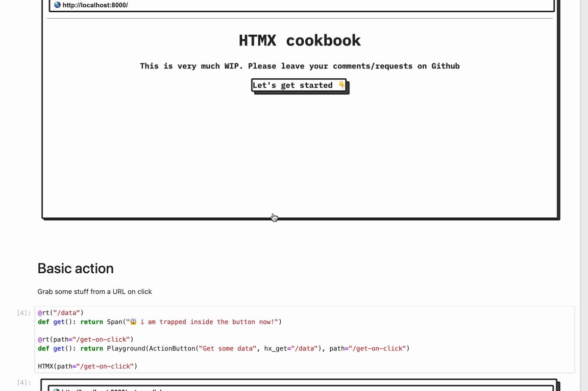

# Welcome to HTMX cookbook

> Please note, this very much WIP. If you have certain recipes that you want to share or want to see, head to [Github](https://github.com/callmephilip/htmx-cookbook)

This cookbook is powered by [FastHTML](https://fastht.ml/). UI is based on [block.css](https://github.com/thesephist/blocks.css)

## Getting started

```
python -m venv .env
source .env/bin/activate
pip install notebook
jupyter notebook
```

The easiest way to run this is to smash `Run -> Run All Cells`. To iterate on a specific recipe, update code in the corresponding cell and rerun it


